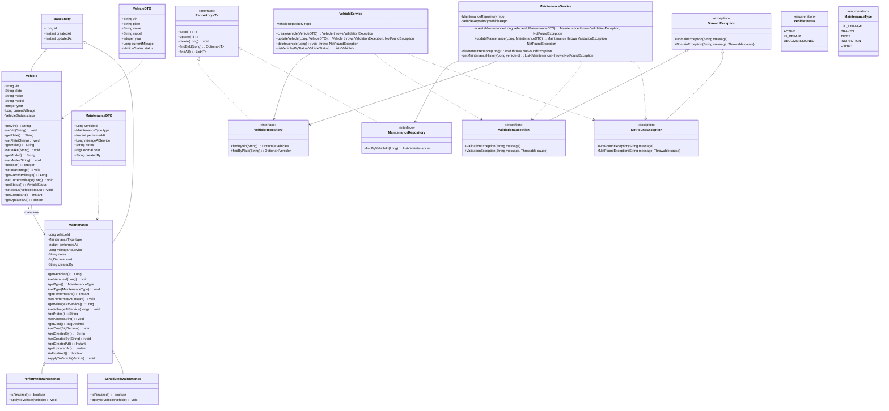

# Projeto: Gestão de Veículos e Manutenções

## Sumário
### Requisitos da Atividade
- Aplicação REST API em Java (OpenJDK 17+).  
- Paradigma: Programação Orientada a Objetos.  
- Banco de dados embarcado (Derby, H2, HSQLDB ou SQLite).  
- CRUD de duas entidades com relacionamento **1..N**.  
- Definição das entidades e atributos deve ser validada previamente pelo professor.  
- **Não utilizar frameworks** como Spring, Quarkus ou Micronaut.  
- Permitido uso de bibliotecas auxiliares (JSON <-> Object, Lombok).  
- Utilizar Maven ou Gradle para gestão de dependências.  
- Obrigatório demonstrar: Abstração, Encapsulamento, Herança e Polimorfismo.  
- Modularização adequada, reuso e baixo acoplamento.  
- `README.md` documentando build, compilação e execução.  

## Resumo
O sistema é destinado à gestão de frotas de veículos, com foco em:

- Controle detalhado de veículos.
- Registro de manutenções.
- Validações de dados importantes como datas e quilometragem.
- Regras de negócio como agendamento de manutenção, atualização de status e histórico de serviços.

A entidade central é **Vehicle (1)**, que possui muitos **MaintenanceRecord (N)**. O sistema permite monitorar o ciclo de vida do veículo, desde a entrada na frota até a desativação.

## Entidades e Atributos

### Vehicle (1)
Representa um veículo da frota.

- **id**: Long — Identificador único (PK, auto-increment).  
- **vin**: String — Número de identificação do veículo (único, 17 caracteres; validação obrigatória).  
- **plate**: String — Placa do veículo (única; validação de formato por país).  
- **make**: String — Marca do veículo (ex.: Toyota, Ford).  
- **model**: String — Modelo do veículo.  
- **year**: Integer — Ano de fabricação (validação: `1900 ≤ year ≤ currentYear`).  
- **currentMileage**: Long — Quilometragem atual do veículo.  
- **status**: VehicleStatus — Enum: `ACTIVE`, `IN_REPAIR`, `DECOMMISSIONED`.  
- **createdAt**: Instant — Data de registro no sistema.  
- **updatedAt**: Instant — Última atualização do registro.  

### MaintenanceRecord (N)
Representa um registro de manutenção do veículo.

- **id**: Long — Identificador único do registro.  
- **vehicleId**: Long — Chave estrangeira referenciando `Vehicle.id`.  
- **type**: MaintenanceType — Enum: `OIL_CHANGE`, `BRAKES`, `TIRES`, `INSPECTION`, `OTHER`.  
- **performedAt**: Instant — Data em que a manutenção foi realizada (não pode ser no futuro).  
- **mileageAtService**: Long — Quilometragem registrada na manutenção.  
- **notes**: String — Observações detalhadas do serviço.  
- **cost**: BigDecimal — Custo da manutenção.  
- **createdBy**: String — Usuário responsável pelo registro.  
- **createdAt**: Instant — Data de criação do registro.  

**Relacionamento:**  
`Vehicle (1) <----> (N) MaintenanceRecord` via `vehicleId`.  

## Regras de Negócio

1. **Unicidade**
   - `vin` e `plate` devem ser **únicos** no sistema para garantir rastreabilidade e evitar duplicidade.

2. **Validação de datas**
   - `MaintenanceRecord.performedAt` **não pode ser no futuro**.
   - Eventos futuros devem ser registrados como **agendamentos**, e não como realizados.

3. **Validação de quilometragem**
   - `mileageAtService` deve ser **≥ 0** e **≤ currentMileage + margem de tolerância**.
   - Se `mileageAtService > currentMileage`, pode-se atualizar `Vehicle.currentMileage` de acordo com a política da frota.

4. **Status do veículo**
   - Veículos com status `DECOMMISSIONED` **não podem receber novos registros de manutenção**.
   - Status `IN_REPAIR` pode indicar que o veículo está temporariamente indisponível.

5. **Controle de custos e histórico**
   - Cada registro de manutenção registra custo, tipo, responsável e notas.
   - Permite **relatórios financeiros** e de manutenção preventiva.

6. **Versão e auditoria**
   - Campos `createdAt` e `updatedAt` permitem rastrear alterações.
   - Possível implementar **log de alterações** para cada manutenção registrada.

## Fluxo de Manutenção (Exemplo)

1. Usuário registra uma manutenção para um veículo:
   - Verifica que veículo não está `DECOMMISSIONED`.
   - Valida `performedAt` e `mileageAtService`.
2. Atualiza quilometragem atual do veículo, se necessário.
3. Adiciona notas e custo do serviço.
4. Atualiza status do veículo, se aplicável (`IN_REPAIR` → `ACTIVE` após conclusão).
5. Mantém histórico completo para auditoria e relatórios.

## Relação do sistema com Java OOP

| Conceito OOP | Como é aplicado no sistema |
|--------------|----------------------------|
| **Herança** | `Vehicle` e `Maintenance` estendem `BaseEntity`, compartilhando atributos comuns e evitando duplicação de código. |
| **Encapsulamento** | Impede acesso direto aos atributos; regras de validação podem ser aplicadas nos setters; estado interno protegido. |
| **Abstração e Polimorfismo** | `Maintenance` define o contrato (`isFinalized()`, `applyToVehicle`) sem implementação concreta; subclasses implementam comportamento específico. |
| **Abstração e Polimorfismo** | Interface define operações genéricas; serviços podem trabalhar com qualquer implementação concreta, permitindo troca sem alterar código consumidor. |
| **Abstração e Encapsulamento** | Centraliza regras de negócio, encapsula lógica de validação e manipulação de entidades, expondo métodos claros para controllers. |
| **Encapsulamento** | Controllers encapsulam detalhes de transporte/rest, expondo apenas endpoints e chamando serviços. |
| **Reuso / Encapsulamento** | Regras de validação centralizadas, usadas por múltiplas classes; reduz duplicação e mantém consistência. |
| **Abstração / Encapsulamento** | Fluxo de erro abstrato e centralizado; serviços e controllers lançam e capturam exceções específicas sem depender de detalhes de implementação. |

## Diagrama de classes UML (Mermaid)

---

## Diagrama de classes UML (Image)

